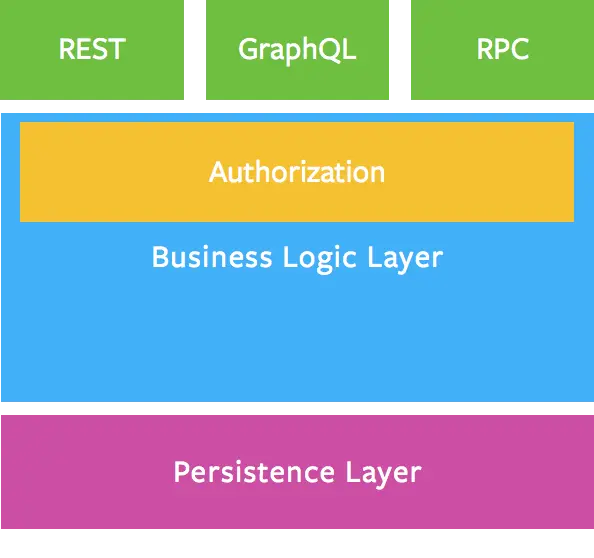

# GraphQL  A Modern Approach to API Design

----

## Rest CRUD Example
----

## The RESTful Struggle

REST APIs are the current standard, but they have limitations

- Over-fetching: Retrieving more data than needed. (Example: A user profile endpoint returns address, phone number,
  etc., when only the name is needed.)
- Under-fetching: Needing to make multiple requests to different endpoints to get all the required data. (Example:
  Getting user details, then their posts, then the comments on those posts, requiring 3 separate calls.)
- Versioning Challenges: Changes to the API can break existing clients.
- Lack of Flexibility: Difficult to adapt to evolving client needs.
----

## Introducing GraphQL

- Developed by Facebook, open-sourced in 2015.
- A query language and runtime for APIs.
- Provides a more efficient, powerful, and flexible way to fetch data.
- Clients request exactly the data they need.
- Single endpoint for all data needs.
----
## GraphQL Queries: Asking for What You Need

- Clients use a query language to request specific data.
- Queries resemble JSON, making them easy to understand.

```
query all {
  breweries {
    name
    createTime
    beers  {
      name
    }
  }
  
   brewery(name:"Augustiener")  {
      name
      history
    }
 
} 
```
-----
## GraphQL Mutations: Changing Data

- Used to create, update, or delete data.
- Similar syntax to queries.

```
mutation createBrewery($brewery: BreweryInput) {
  createBrewery(brewery: $brewery) {
    name
    yearOfFounding
    history
  }
} variables
{
  "brewery": {
    "name": "Ronald",
    "imageLink": "image",
    "yearOfFounding": 2023,
    "history": "History",
    "createTime": "2025-02-28T09:49:16.363656"
  }
}

```
------
## GraphQL Subscriptions: Real-time Updates

- Enable real-time, event-driven updates.
- Clients subscribe to specific events.
- Server pushes updates as they occur.

```
subscription newBrewery {
   breweryCreated {
    name
  	yearOfFounding
    createTime
    history
  }
}

```
----------
## GraphQL Ecosystem
- MicroProfile standard specification
- Growing ecosystem with various tools and libraries.
- Popular server implementations (e.g., Apollo Server, GraphQL Yoga).
- Client libraries (e.g., Apollo Client, Relay).
- GraphQL Playground/GraphiQL for testing and exploring APIs.
--------
## GraphQL vs. REST: A Comparison
| Feature |REST|                                                                         GraphQL                                                                                                                     |
|-------------------|---------------------------------------------------------------------------------------------------------------------------------------------------------|-----------------------------------------------------------------------------------------------------------------------------|
| Data Fetching     | Multiple endpoints for specific resources. Can lead to over-fetching (receiving more data than needed) or under-fetching (requiring multiple requests). | Single endpoint. Clients specify exactly the data they need, preventing over-fetching and under-fetching. |
| Flexibility       | Less flexible. Changes to the API often require changes to clients.| More flexible. Clients can adapt their requests as needed without breaking existing API versions.|
| Efficiency        | Can be less efficient due to multiple requests and potential for over-fetching.| More efficient due to reduced network traffic and optimized data transfer. |
------------


|  Feature          |REST|                                                                         GraphQL                                                                                                                     |
|-------------------|---------------------------------------------------------------------------------------------------------------------------------------------------------|-----------------------------------------------------------------------------------------------------------------------------|
| Schema            | No formal schema definition.| Strong typing with a schema definition language (SDL). Enforces data structure and improves developer experience.  |
| Real-time Updates | No built-in support for real-time updates. Requires additional techniques like WebSockets.                                                              | Built-in support for real-time updates through subscriptions.                                                               |
| Learning Curve    | 	Generally easier to learn and implement.                                                                                                               |Can have a steeper learning curve due to the query language and schema definition. |

--------
## When to Choose GraphQL

- Mobile applications: Optimizing data transfer for limited bandwidth.
- Real-time applications: Live dashboards, chat applications.
- Complex data structures: Easily accessing and combining data from multiple sources.
- Microservices: Unifying data access across different services.
-------
## When to Choose REST

- Simple APIs with well-defined resources.
- When a simpler approach is preferred.
---------
## Real Live Approach



-----

## One Step at a time

Don’t try to model your entire business domain in one sitting. Rather, build only the part of the schema that you need for one scenario at a time. By gradually expanding the schema, you will get validation and feedback more frequently to steer you toward building the right solution.

-----
## Working with Legacy Data

Prefer building a GraphQL schema that describes how clients use the data, rather than mirroring the legacy database schema.

----

## Links

[GraphQL](https://graphql.org/)

[Microprofile GraphQL](https://microprofile.io/specifications/microprofile-graphql/)


